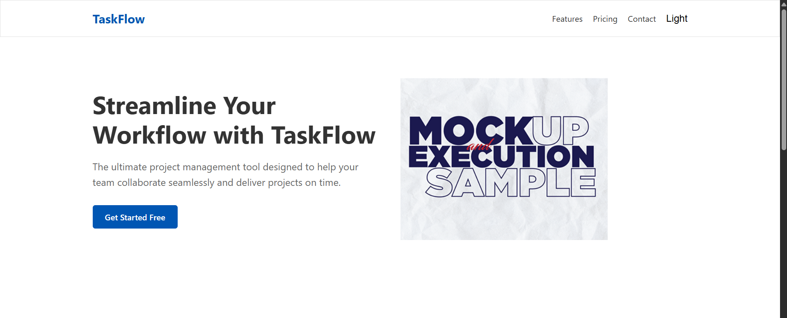
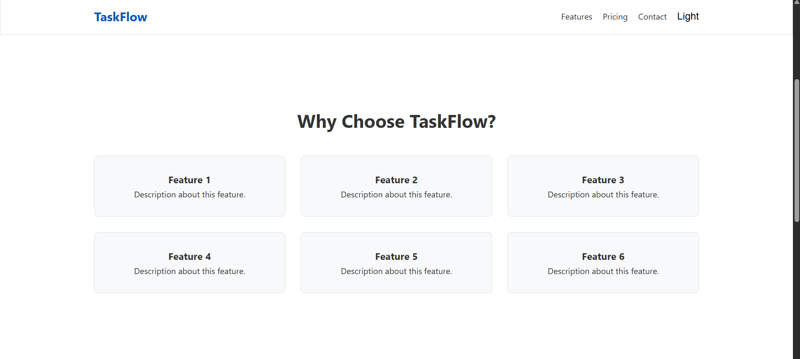
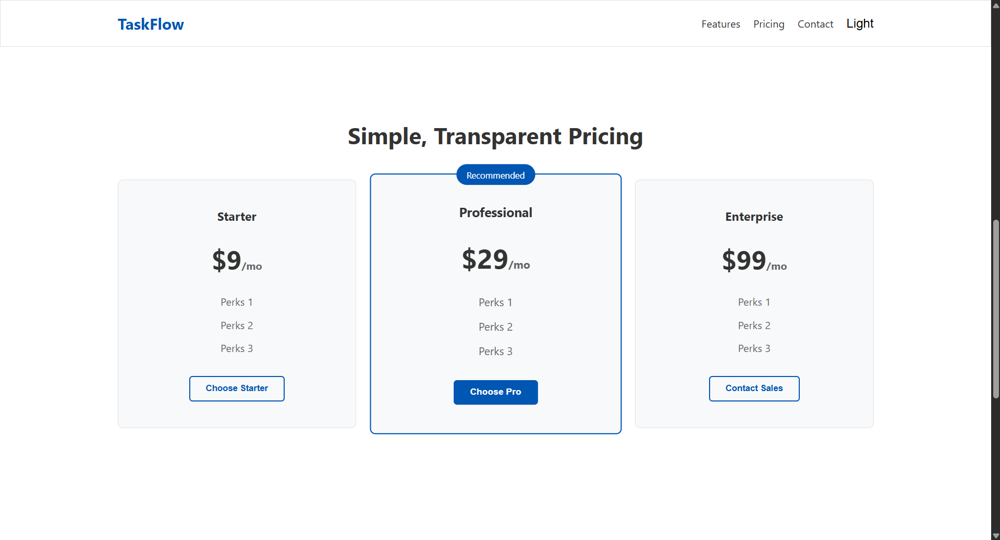
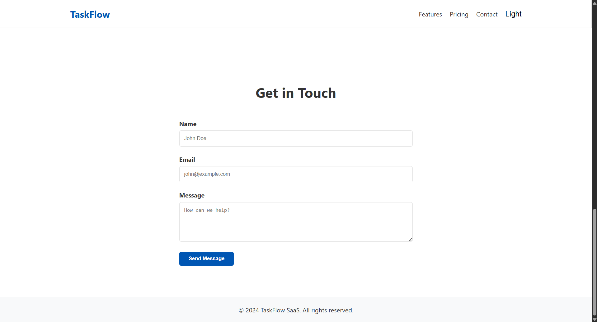

# TaskFlow SaaS Landing Page

This repository contains the front-end implementation of the TaskFlow Figma design.

## Technologies Used
* HTML5 (Semantic Structure)
* CSS3 (Grid, Flexbox, Variables, Media Queries)
* Vanilla JavaScript (ES6)

## Features Included
* **Fully Responsive:** Layout scales beautifully across Mobile, Tablet, and Desktop.
* **Dark Mode:** Integrated Light/Dark theme toggle that persists user preference via `localStorage`.
* **Form Validation:** Client-side form validation for name, proper email formatting, and message.
* **Accessibility (a11y):** Implemented ARIA labels, semantic tags, and optimized contrast.
* **Performance:** Implemented lazy loading for images and lightweight CSS/JS without heavy frameworks.

## Setup Instructions
1. Clone the repository.
2. Open `index.html` in any modern web browser.